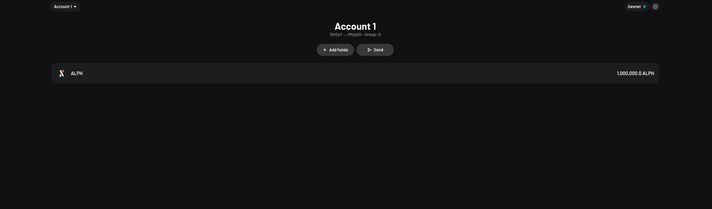
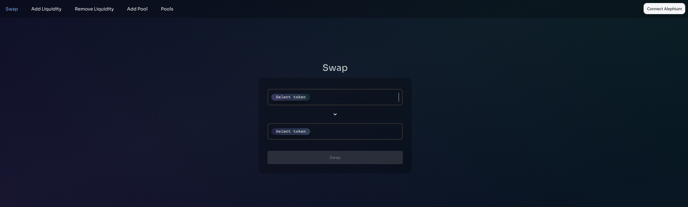

# Alephium DEX

## Install Alephium Extension Wallet

The alephium extension wallet is required if you want to run the DEX, but we have not released the extension wallet yet, you need to install the extension wallet manually:

1. Clone the extension wallet repo: `git clone git@github.com:alephium/extension-wallet.git && cd extension-wallet`
2. Build the extension wallet: `yarn && yarn build`
3. Load the unpacked extension wallet following this guide: https://developer.chrome.com/docs/extensions/mv3/getstarted/development-basics/#load-unpacked, the unpacked extension directory located at: `extension-wallet/packages/extension/dist`

## Setup devnet

1. Clone the alephium-stack repo: `git@github.com:alephium/alephium-stack.git && cd alephium-stack/devnet`
2. Start the devnet: `docker compose up`

Now you can open the `chrome-extension://moljmieldicknmedbeibcdeopilpdlgg/index.html` and restore wallet with the devnet mnemonic:

```text
vault alarm sad mass witness property virus style good flower rice alpha viable evidence run glare pretty scout evil judge enroll refuse another lava
```

Then create an account following the instruction, and you will see something like this: 

## Build and Run DEX

### Clone the DEX repo

```
git clone git@github.com:Lbqds/alephium-dex.git
cd alephium-dex
```

### Deploy dex contracts

```
npm install && npm run build && npm run deploy
```

### Create test tokens on devnet

```
npx ts-node scripts/devnet.ts create-tokens -n 5
```

It will create 5 test tokens on devnet, you can also create your own token contracts following [this guide](https://docs.alephium.org/dapps/getting-started).

The output contains all created token contract ids, which will be used when creating token pool in UI.

## UI

Build and run the UI:

```
cd ui && npm install && npm run build && npm run start
```

Now you can open the `http://localhost:3000/alephium-dex`, you will see something like this: 

And now you can test the DEX by creating token pool, adding liquidity to the token pool, swapping tokens, and removing liquidity from the token pool.
